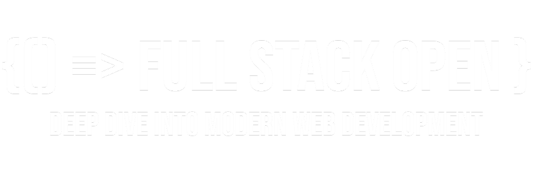
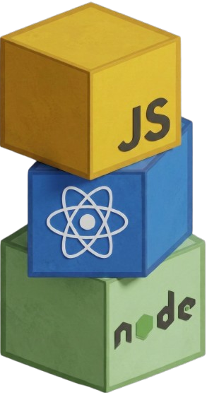
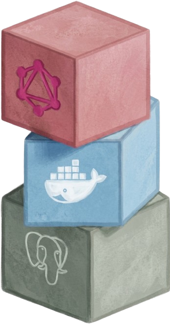
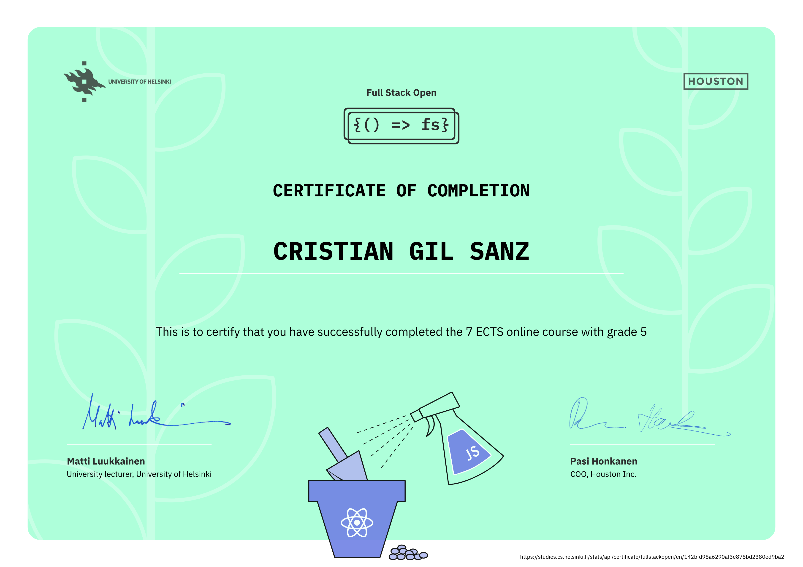

   
  
  
  *Learn React, Redux, Node.js, MongoDB, GraphQL and TypeScript in one go!*
   
   
  <code>██████████████████████░░░░░░░░░░░░░</code>
  <b>57%</b>
   
  <b>8 / 14</b>
   

  
  
  

 
 
 

# 📚 **Course Content**

  | # | Part | Status |
  |:--:|------|:------:|
  | **0** | [Fundamentals of Web Apps](https://fullstackopen.com/en/part0) | 📁 [Part 0](./part-0) |
  | **1** | [Introduction to React](https://fullstackopen.com/en/part1) | 📁 [Part 1](./part-1) |
  | **2** | [Communicating with Server](https://fullstackopen.com/en/part2) | 📁 [Part 2](./part-2) |
  | **3** | [Programming a Server with NodeJS and Express](https://fullstackopen.com/en/part3) | 📁 [Part 3](./part-3) |
  | **4** | [Testing Express Servers, User Administration](https://fullstackopen.com/en/part4) | 📁 [Part 4](./part-4) |
  | **5** | [Testing React Apps](https://fullstackopen.com/en/part5) | 📁 [Part 5](./part-5) |
  | **6** | [Advanced State Management](https://fullstackopen.com/en/part6) | 📁 [Part 6](./part-6) |
  | **7** | [React Router, Custom Hooks, Styling App with CSS and Webpack](https://fullstackopen.com/en/part7) | 📁 [Part 7](./part-7) |
  | **8** | [GraphQL](https://fullstackopen.com/en/part8) | ⏳ Pending |
  | **9** | [TypeScript](https://fullstackopen.com/en/part9) | ⏳ Pending |
  | **10** | [React Native](https://fullstackopen.com/en/part10) | ⏳ Pending |
  | **11** | [CI/CD](https://fullstackopen.com/en/part11) | ⏳ Pending |
  | **12** | [Containers](https://fullstackopen.com/en/part12) | ⏳ Pending |
  | **13** | [Using Relational Databases](https://fullstackopen.com/en/part13) | ⏳ Pending |

# 🗺️ **Journey Map**

  | Certificate | Code | Credits | Parts | Status |
  |-------------|:----:|:-------:|:-----:|:------:|
  | **Full Stack Web Development** (Core) | CSM141081 | 5–7 cr | 0–7 | ✅ Done |
  | **Full Stack Web Development** (Ext. 1) | CSM141082 | +1 cr | 0–7 (≥127 ex) | ✅ Done |
  | **Full Stack Web Development** (Ext. 2) | CSM141083 | +1 cr | 0–7 (≥138 ex) | ✅ Done |
  | **GraphQL** | CSM14113 | +1 cr | 8 | ⏳ Pending |
  | **TypeScript** | CSM14110 | +1 cr | 9 | ⏳ Pending |
  | **React Native** | CSM14111 | +2 cr | 10 | ⏳ Pending |
  | **CI/CD** | CSM14112 | +1 cr | 11 | ⏳ Pending |
  | **Containers** | CSM141084 | +1 cr | 12 | ⏳ Pending |
  | **Relational Databases** | CSM14114 | +1 cr | 13 | ⏳ Pending |

# 🎓 **Certificates**

  ### Full Stack Web Development — Core · Extension 1 · Extension 2

  

# 🙏 **Credits & Thanks**

Special thanks to the [*University of Helsinki*](https://www.helsinki.fi/en) and **Matti Luukkainen** for building and maintaining the outstanding **[Full Stack Open Course](https://fullstackopen.com/en/)** ✨.

Additional content contributed by developers from **Terveystalo**, **Smartly.io**, and other industry partners.

# 📄 **License**

This project is licensed under the MIT License — see the [LICENSE](LICENSE) file for details.

# 📞 **Get Help & Connect**

- 💬 [Start a discussion](https://github.com/cristiangilsanz/full-stack-open/discussions)
- 🐛 [Open an issue](https://github.com/cristiangilsanz/full-stack-open/issues)
- 📧 [cristiangilsanz@gmail.com](mailto:cristiangilsanz@gmail.com)

   

  **Made with 💖 for the Full Stack Developer Community**

  [⭐ Star this repo](https://github.com/cristiangilsanz/full-stack-open) · [🍴 Fork it](https://github.com/cristiangilsanz/full-stack-open/fork)
  
   

  

