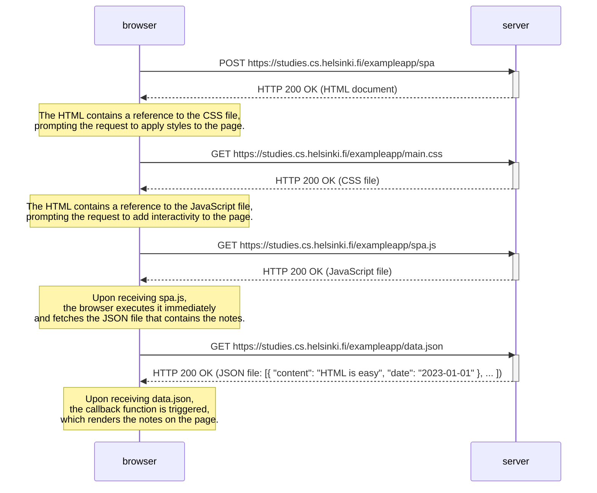

```mermaid
sequenceDiagram

    participant browser
    participant server

    browser->>server: POST https://studies.cs.helsinki.fi/exampleapp/spa
    
    activate server
    server-->>browser: HTTP 200 OK (HTML document)
    deactivate server

    note over browser: The HTML contains a reference to the CSS file,<br/> prompting the request to apply styles to the page.

    browser->>server: GET https://studies.cs.helsinki.fi/exampleapp/main.css
    
    activate server
    server-->>browser: HTTP 200 OK (CSS file)
    deactivate server

    note over browser: The HTML contains a reference to the JavaScript file,<br/> prompting the request to add interactivity to the page.

    browser->>server: GET https://studies.cs.helsinki.fi/exampleapp/spa.js
    
    activate server
    server-->>browser: HTTP 200 OK (JavaScript file)
    deactivate server
    
    note over browser: Upon receiving spa.js,<br/> the browser executes it immediately<br/> and fetches the JSON file that contains the notes.

    browser->>server: GET https://studies.cs.helsinki.fi/exampleapp/data.json

    activate server
    server-->>browser: HTTP 200 OK (JSON file: [{ "content": "HTML is easy", "date": "2023-01-01" }, ... ])
    deactivate server

    note over browser: Upon receiving data.json,<br/> the callback function is triggered,<br/> which renders the notes on the page.
```
