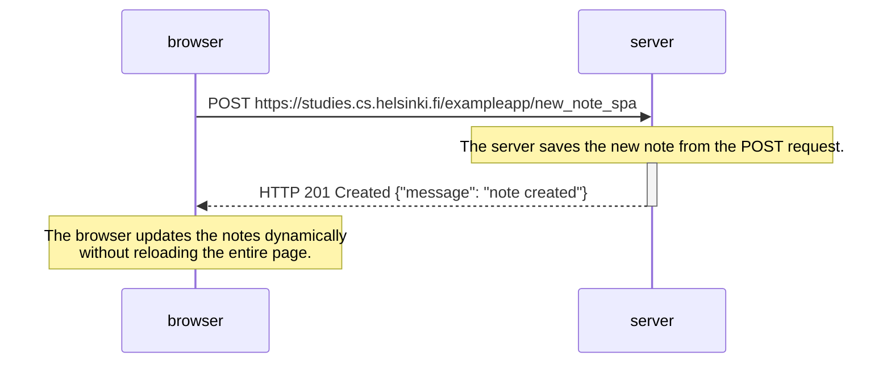

```mermaid
sequenceDiagram

    participant browser
    participant server

    browser->>server: POST https://studies.cs.helsinki.fi/exampleapp/new_note_spa

    note over server: The server saves the new note from the POST request.

    activate server
    server-->>browser: HTTP 201 Created {"message": "note created"}
    deactivate server

    note over browser: The browser updates the notes dynamically <br/> without reloading the entire page.
```
